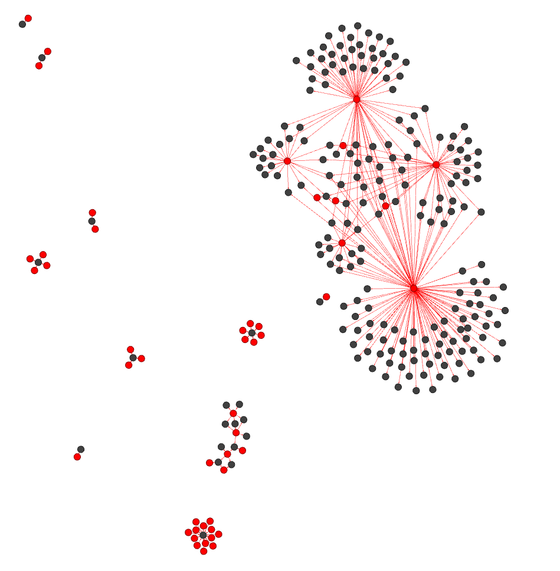

# Overview

There are a few scripts in this folder.

## Graph visualization examples

The [visualizeWindowsFirewallLogs](/demo/graphs-n-minizinc-demo/visualizeWindowsFirewallLogs.ps1) script takes Windows Firewall logs as an input and produces the graph of connections using [PSQuickGraph](https://github.com/eosfor/PSGraph) module. This way you can see the communications in the least disruptive way, as Windows Firewall is a part of the OS, so you do not need to install any special software.

The [visualizeWindowsFirewallLogs](/demo/graphs-n-minizinc-demo/visualizeSysMonLog.ps1) does the next step. It is a little bit more "invasive" as it uses logs, produced by the [SysMon](https://docs.microsoft.com/en-us/sysinternals/downloads/sysmon) tool. The tool logs network connections, including each connection’s source process, IP addresses, port numbers, hostnames, and port names. It installs the driver to do it. To control such behavior you can configure the tool using the XML-based [configuration files](https://docs.microsoft.com/en-us/sysinternals/downloads/sysmon#configuration-files).

If you combine the logs from multiple servers, for example from all application servers of a single app, you should be able to build a graph of all communications happening inside and outside the application.

Both scripts produce a graph and visualize it, to simplify the identification of communication channels. However, the visualization feature is relatively weak and should only be used for small graphs. The bigger graphs can be visualized by using tools like [Gephi](https://gephi.org/). The picture below is a visualization of a `sysmon` graph using Gephi.

## A bit of decision making and modeling

In this section, we have simple [MiniZinc](https://www.minizinc.org/) models.

The [vmCostsCalculation](/demo/graphs-n-minizinc-demo/vmCostsCalculation.mzn) MiniZinc model tries to minimize the total price of a set of VMs. It takes the existing VM sizes, and then tries to pick the corresponding Azure side from the list provides, which is close enough to the source VM. Additionally, the model tries to minimize the cost of the whole set of the target Azure VMs.

The [estimateKubernetesClusterCosts](/demo/graphs-n-minizinc-demo/estimateKubernetesClusterCosts.mzn) MiniZinc model tries to make a high-level estimation and tries to minimize costs of an N-node cluster, taking into consideration the max CPU, RAM, and overall load of a set of applications. If the model returns `=====UNSATISFIABLE=====`, it most likely means that the cluster is either too small and cannot fit the load, or it is too big so some nodes are empty or underloaded.

I'd recommend taking the following courses on MiniZinc:

- [Basic Modeling for Discrete Optimization](https://www.coursera.org/learn/basic-modeling)
- [Advanced Modeling for Discrete Optimization](https://www.coursera.org/learn/advanced-modeling)
